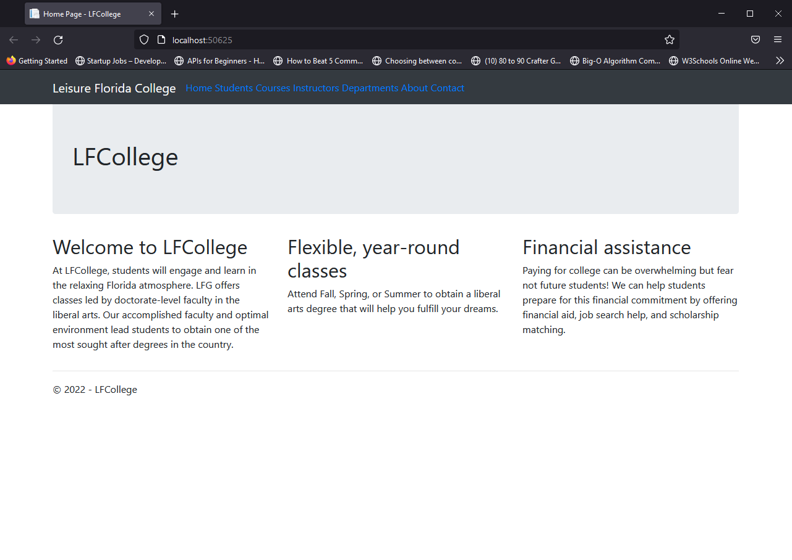
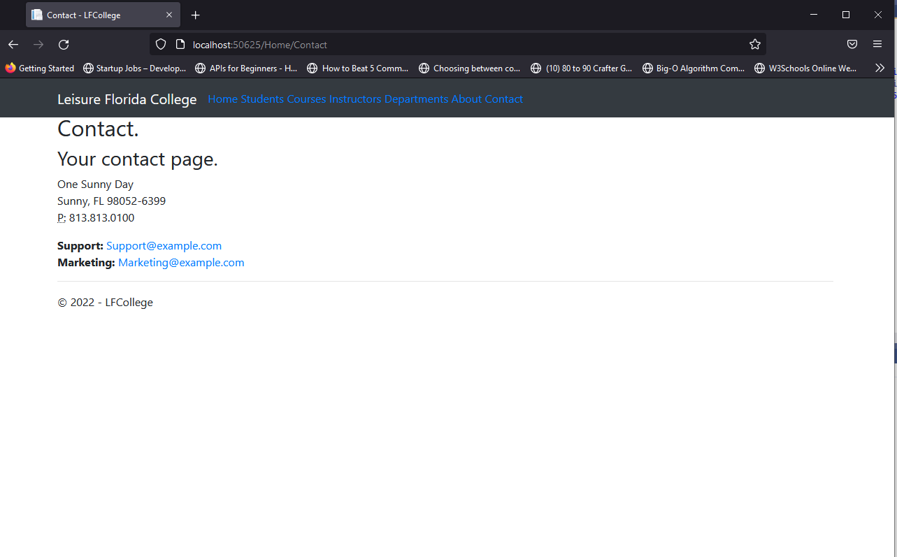
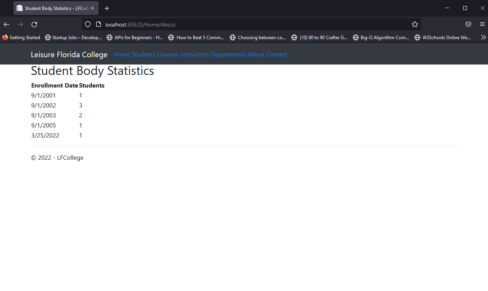
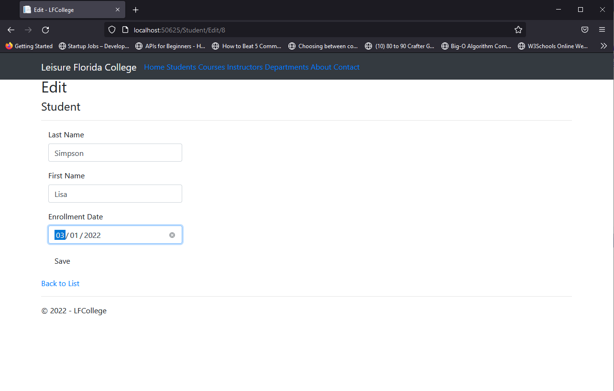
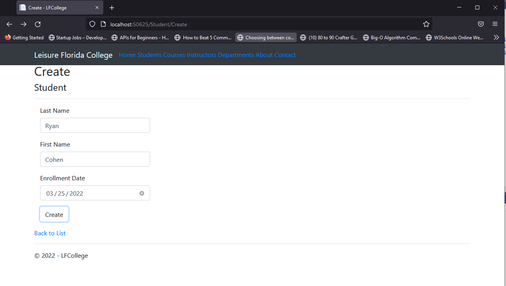
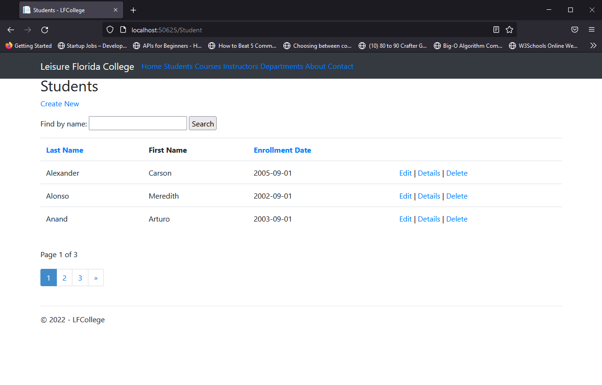

# LFCollege
ASP.NET website connected to the cloud through Azure.
 College website that connects to a database to manage courses, instructors, students, grades, and locations.

Various images of website in use.

